# Py-tetris

A little project using pygame.

## Play

### 1 - Create virtual environment.

```sh
python3 -m venv venv
```

### 2 - Install the dependencies in `requirements.txt`.

```sh
python3 -m pip install -r requirements.txt
```

### 3 - Run

```sh
python3 src/main.py
```

### 4 - Keys

- `space`: hard drop
- `a`: lock tetromino
- `h`: left
- `l`: right
- `j`: down (soft drop)
- `z`: rotate left
- `x`: rotate right
- `k`: rotate 180
- `c`: swap tetromino

## Specifications

Following [this guideline](https://harddrop.com/wiki/Tetris_Guideline)

[Lock delay](https://harddrop.com/wiki/Lock_delay): TO-DO

[Random Generator](https://harddrop.com/wiki/Random_Generator): [TGM randomizer](https://harddrop.com/wiki/TGM_randomizer)

[Rotation System](https://harddrop.com/wiki/Rotation_system): [Super/Standard Rotation System](https://harddrop.com/wiki/SRS)

[Scoring System](https://harddrop.com/wiki/Category:Scoring_Systems): TO-DO

[Tetromino Orientation](https://harddrop.com/wiki/Orientation): Default

## Code classes UML

```mermaid
classDiagram
    class State{
      +int Stay$
      +int Title$
      +int Settings$
      +int Game$
    }

    class Screen{
      +Clock fps
      +State state
      +Content content
      +change(State)
    }

    class Content{
      +update()*
      +draw()*
    }

    Content <|-- Game
    class Game{
      +Logic game
      +int border
      +int brick_size
      +Brick brick_skin
      +update()
      +draw()
      +draw_grid()
      +draw_border()
      +draw_stats()
      +draw_score()
      +draw_next_tetromino()
      +draw_swap_tetromino()
      +draw_current_tetromino()
      +draw_shadow_tetromino()
      +draw_tetromino()
    }

    Content <|-- Settings
    class Settings{
      +list[str] options
      +update()
      +draw()
    }

    Content <|-- Title
    class Title{
      +list[str] options
      +int border
      +update()
      +draw()
      +draw_buttons()
      +draw_title()
    }

    class Tetromino_generator{
      +dict[Shape, int] counter
      +Randomizer randomizer
      +list[Shape] history
      +next_tetromino()
      +add_history()
    }

    class Randomizer{
      +get_random()*
    }

    Randomizer <|-- Classic_tetris
    class Classic_tetris{
      +get_random()*
    }

    Randomizer <|-- Modern_tetris
    class Modern_tetris{
      +fill_tetromino_bag()*
      +get_random()*
    }

    Randomizer <|-- TGM
    class TGM{
      +dict[int, Shape] tetrominos
      +int tries
      +bool first
      +get_random()*
    }

    class Logic{
      +int lock_delay
      +int frames
      +int score
      +list[list[tuple[int,int,int]]] grid
      +Optional[Tetromino] current_tetromino
      +bool can_swap
      +Optional[Tetromino] hold_tetromino
      +list[Tetromino] next_tetrominos
      +Tetromino_generator generator
      +input_action()
      +next_tetromino()
      +swap_tetromino()
      +lock_tetromino()
      +clear_row()
      +check_alive()
    }

    class Colors{
      +int BLACK$
      +int GRAY$
      +int WHITE$
      +int RED$
      +int GREEN$
      +int BLUE$
      +int CYAN$
      +int YELLOW$
      +int PURPLE$
      +int ORANGE$
    }

    class Color_mod{
      +dict[Shape, Colors] get_color$
      +get_shadow_from_color()
      +get_shadow_from_tuple()
      +get_light_from_color()
      +get_light_from_tuple()
    }

    class Brick{
      +draw_brick()*
    }

    Brick <|-- Standard_Brick
    class Standard_Brick{
      +draw_brick()
    }

    Brick <|-- Line_Brick
    class Line_Brick{
      +draw_brick()
    }

    Brick <|-- Shiny_Brick
    class Shiny_Brick{
      +draw_brick()
    }

    Brick <|-- Open_Brick
    class Open_Brick{
      +draw_brick()
    }

    Brick <|-- Border_Brick
    class Border_Brick{
      +draw_brick()
    }

    class Shape{
      +list[list[str]] SHAPE_O$
      +list[list[str]] SHAPE_I$
      +list[list[str]] SHAPE_T$
      +list[list[str]] SHAPE_S$
      +list[list[str]] SHAPE_Z$
      +list[list[str]] SHAPE_J$
      +list[list[str]] SHAPE_L$
    }

    class SRS{
      +list[list[tuple[int, int]]] rot
    }

    class Tetromino{
      +get_shape()
      +move()
      +down()
      +hard_drop()
      +rotate_180()
      +rotate()
      +check()
      +reset()
      +reset_delay()
    }
```


